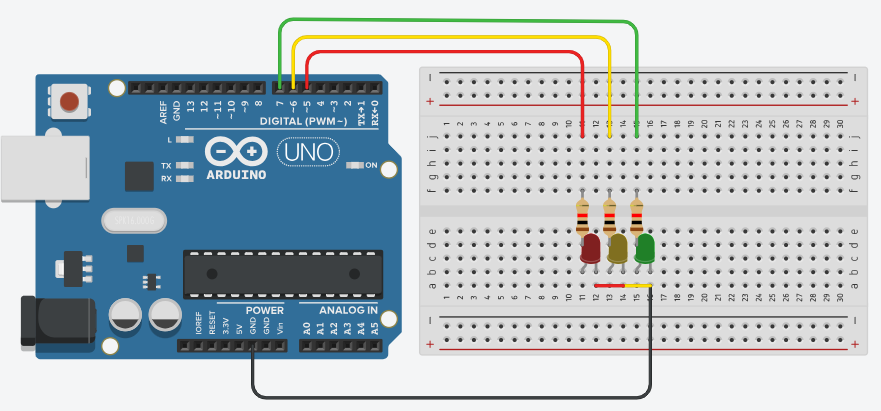

# Semáforo

Montagem de um semáforo utilizando Arduino UNO. 

Esse projeto foi implementado utilizando duas abordagens

- Uma implementação limpa utilizando os registradores do Atmega328p
- Uma implementação mais verbosa utilizando os comandos nativos do Arduino